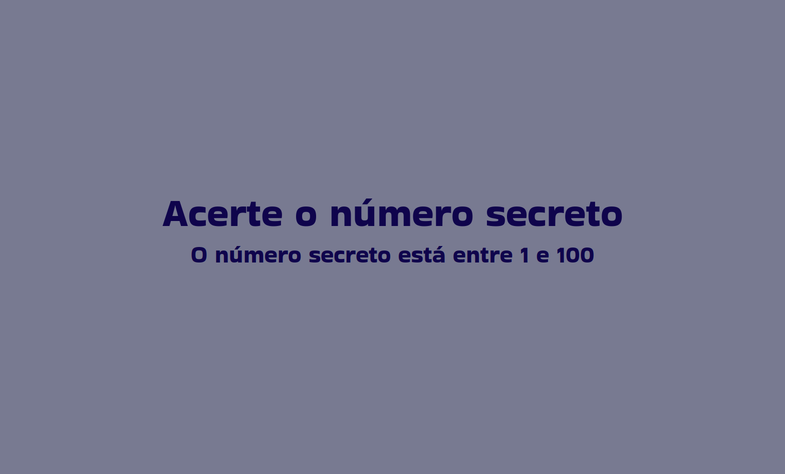
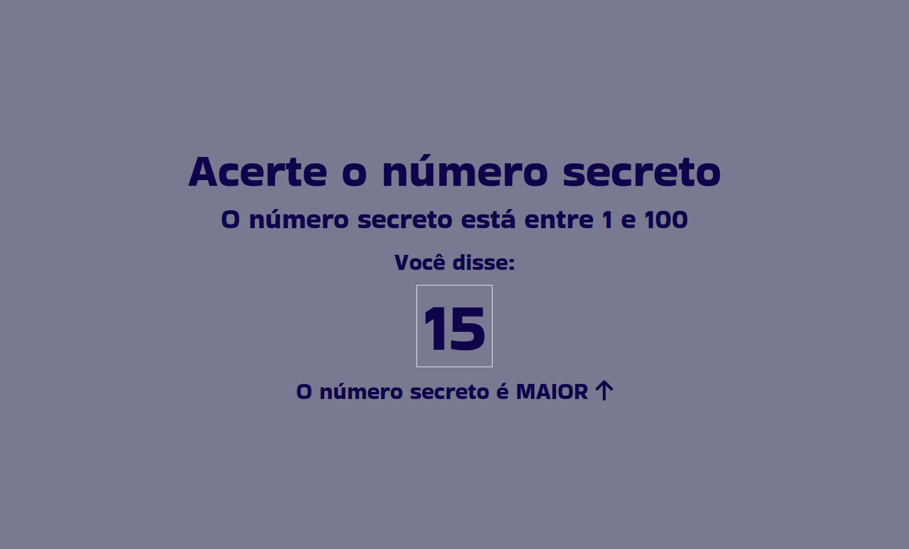
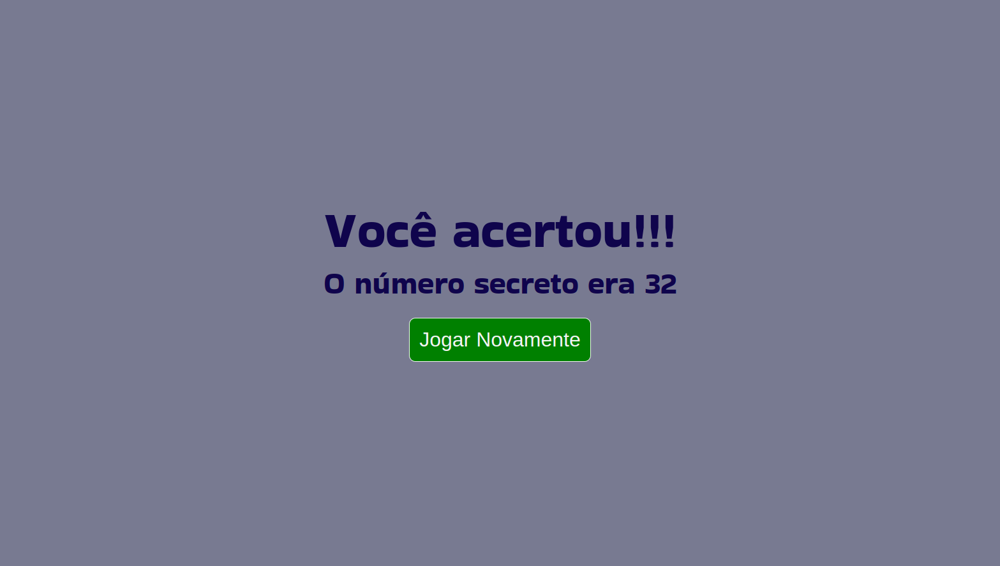
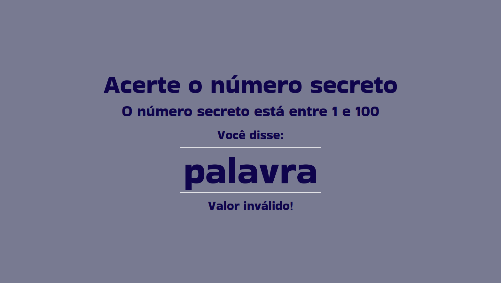
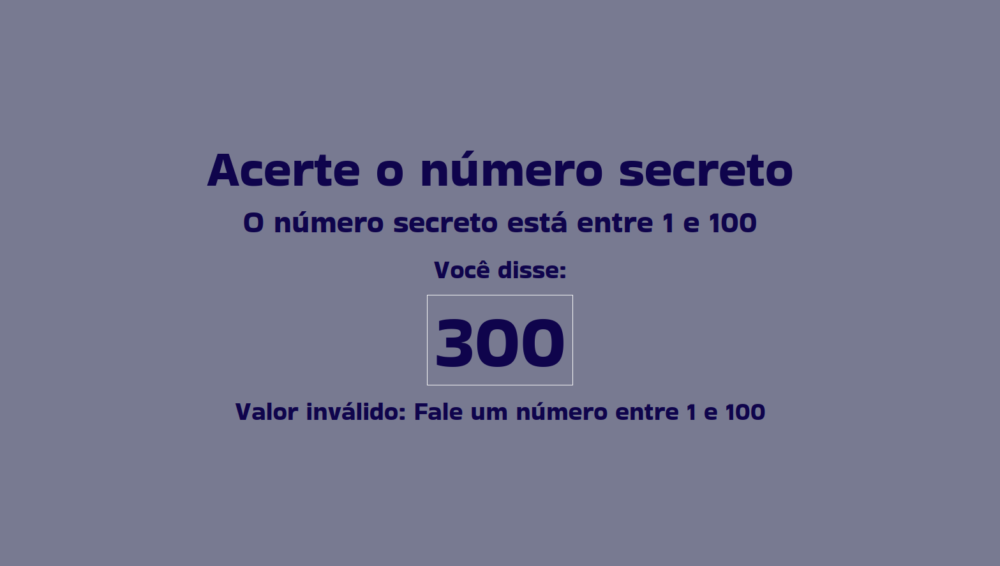

# Número Secreto

Um game onde o objetivo é adivinhar um número escolhido de forma aleatória pelo sistema. Além disso, o projeto conta com o reconhecimento de voz.

| :placard: Vitrine.Dev |     |
| -------------  | --- |
| :sparkles: Nome        | **Número Secreto**
| :label: Tecnologias | HTML, CSS e JavaScript
| :rocket: URL         | https://numero-secreto-mu.vercel.app/
| :fire: Desafio     | -

## Detalhes do projeto

Projeto usando HTML, CSS e JavaScript com foco no uso do reconhecimento de voz através do navegador e o uso de validações. Nesse projeto aprendi: 
 • Como aplicar validações em meus projeto com JavaScript;  
• Aplicar reconhecimento de voz com JavaScript;  
• Manipular dados, eventos e elementos com JavaScript;  

## Funcionamento

## 1. Ao abrir o projeto o navegador pedira autorização para usar o microfone, habilitando o reconhecimento de voz.

</img>

## 2. Diga um número entre 1 e 100. O jogo irá reconhecer o número dito e te dará uma dica indicando se o número secreto é maior ou menor.

</img>

</img>

## 3. Ao acertar o número, o jogo irá indicar o seu acerto e aparecerá um botão com a opção de se jogar de novo. Caso clique no botão, o jogo irá sortear outro número.

</img>

## 4. O jogo possui algumas validações, como o reconhecimento de palavras ou a identificação de um número fora do limite proposto pelo jogo. Caso identificado algum dos casos citados, aparecerá uma mensagem indicando.

</img>

</img>

